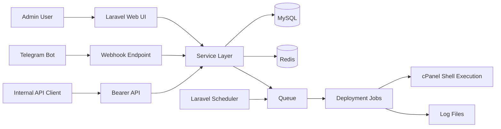

# Deployment Architecture

```mermaid
flowchart LR
    U[Admin User] --> W[Laravel Web UI]
    TG[Telegram Bot] --> H[Webhook Endpoint]
    API[Internal API Client] --> A[Bearer API]

    W --> S[Service Layer]
    H --> S
    A --> S

    S --> R[(MySQL)]
    S --> C[(Redis)]
    S --> Q[Queue]
    Q --> J[Deployment Jobs]
    J --> SH[cPanel Shell Execution]
    J --> L[Log Files]

    SCH[Laravel Scheduler] --> Q
```
