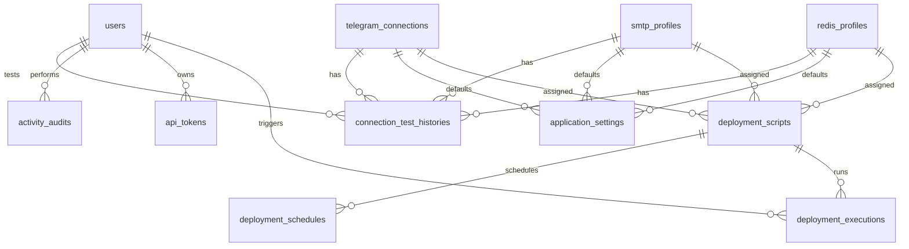

# ERD

```mermaid
erDiagram
    users ||--o{ deployment_executions : triggers
    users ||--o{ api_tokens : owns
    users ||--o{ activity_audits : performs

    redis_profiles ||--o{ deployment_scripts : assigned
    smtp_profiles ||--o{ deployment_scripts : assigned
    telegram_connections ||--o{ deployment_scripts : assigned

    deployment_scripts ||--o{ deployment_executions : runs
    deployment_scripts ||--o{ deployment_schedules : schedules

    telegram_connections ||--o{ application_settings : defaults
    smtp_profiles ||--o{ application_settings : defaults
    redis_profiles ||--o{ application_settings : defaults

    users ||--o{ connection_test_histories : tests
    redis_profiles ||--o{ connection_test_histories : has
    smtp_profiles ||--o{ connection_test_histories : has
    telegram_connections ||--o{ connection_test_histories : has
```
