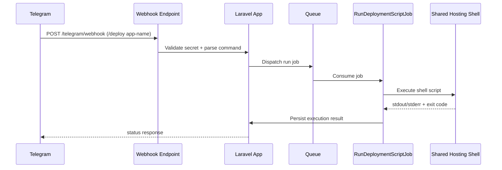

# Telegram Deploy Sequence

```mermaid
sequenceDiagram
    participant TG as Telegram
    participant WH as Webhook Endpoint
    participant APP as Laravel App
    participant Q as Queue
    participant JOB as RunDeploymentScriptJob
    participant SH as Shared Hosting Shell

    TG->>WH: POST /telegram/webhook (/deploy app-name)
    WH->>APP: Validate secret + parse command
    APP->>Q: Dispatch run job
    Q->>JOB: Consume job
    JOB->>SH: Execute shell script
    SH-->>JOB: stdout/stderr + exit code
    JOB->>APP: Persist execution result
    APP-->>TG: status response
```
